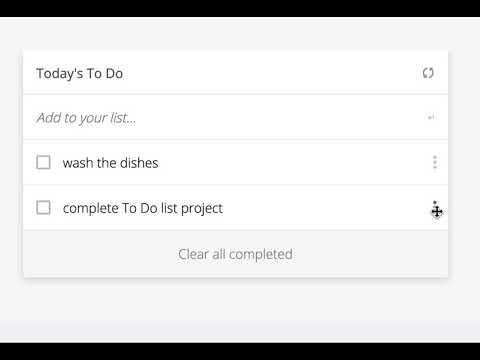

<a name="readme-top"></a>


<div align="center">

  
  <br/>

  <h3><b>Portfolio</b></h3>

</div>


# 📗 Table of Contents

- [📖 About the Project](#about-project)
  - [🛠 Built With](#built-with)
    - [Key Features](#key-features)
- [💻 Getting Started](#getting-started)
  - [Setup](#setup)
  - [Prerequisites](#prerequisites)
  - [Usage](#usage)
- [👥 Authors](#authors)
- [🔭 Future Features](#future-features)
- [🤝 Contributing](#contributing)
- [⭐️ Show your support](#support)
- [🙏 Acknowledgements](#acknowledgements)
- [❓ FAQ](#faq)
- [📝 License](#license)


# 📖 Fullstack Development <a name="To-Do List"></a>

**To-Do list* a simple HTML list of To Do tasks. 

## 🛠  Built With <a name="built-with"></a>


### Key Features <a name="key-features"></a>


  
<p align="right">(<a href="#readme-top">back to top</a>)</p>

## 💻 Getting Started <a name="getting-started"></a>

### Prerequisites

In order to run this project you need:


### Setup

Clone this repository to your desired folder:
```sh
  git clone https://github.com/sagieramos/webpack $HOME
```
### Usage

To run the project, execute the following command:

```sh
  cd $HOME/webpack
  npm install
  npm run build
  npm run dev
```

<p align="right">(<a href="#readme-top">back to top</a>)</p>


## 👥 Authors <a name="authors"></a>
👤 ***Stanley Osagie Ramos**
- GitHub: [@sagieramos](https://github.com/sagieramos)
- Twitter: [@sagieramos](https://twitter.com/sagieramos)
- LinkedIn: [LinkedIn](https://linkedin.com/in/sagieramos)

<p align="right">(<a href="#readme-top">back to top</a>)</p>


## 🔭 Future Features <a name="future-features"></a>

- [ ] **Add web games**
- [ ] **Database**

<p align="right">(<a href="#readme-top">back to top</a>)</p>


## 🤝 Contributing <a name="contributing"></a>

Contributions, issues, and feature requests are welcome!

Feel free to check the [issues page](../../issues/).

<p align="right">(<a href="#readme-top">back to top</a>)</p>


## ⭐️ Show your support <a name="support"></a>

If you like this project, please consider subscribing to my GitHub account for updates and more projects

<p align="right">(<a href="#readme-top">back to top</a>)</p>


## 🙏 Acknowledgments <a name="acknowledgements"></a>
- Jehovah.
- [Microverse Team](https://www.microverse.org/).

<p align="right">(<a href="#readme-top">back to top</a>)</p>

## ❓ FAQ <a name="faq"></a>

- **Can I run this project with a Docker?**

  - Yes

<p align="right">(<a href="#readme-top">back to top</a>)</p>

## 📝 License <a name="license"></a>

This project is [MIT](./LICENSE) licensed.

<p align="right">(<a href="#readme-top">back to top</a>)</p>