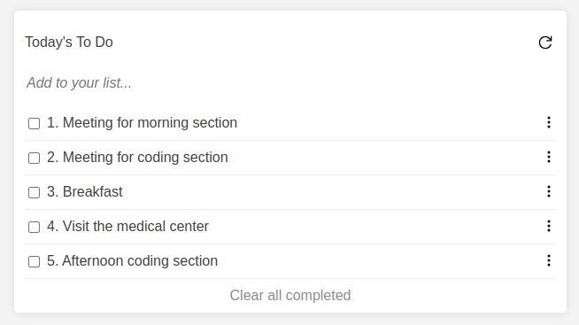
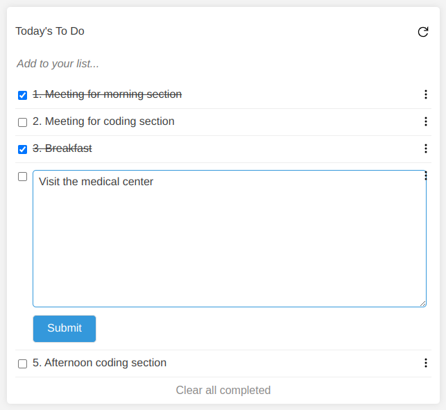

<a name="readme-top"></a>


<div align="center">

  
  
  <br/>

  <h3><b>To-DoList</b></h3>

</div>

# 📗 Table of Contents

- [📗 Table of Contents](#-table-of-contents)
- [📖 Fullstack Development ](#-fullstack-development-)
  - [🛠  Built With ](#--built-with-)
    - [Key Features ](#key-features-)
  - [🚀 Live Demo](#live-demo)
  - [💻 Getting Started ](#-getting-started-)
    - [Prerequisites](#prerequisites)
    - [Setup](#setup)
    - [Usage](#usage)
  - [👥 Authors ](#-authors-)
  - [🔭 Future Features ](#-future-features-)
  - [🤝 Contributing ](#-contributing-)
  - [⭐️ Show your support ](#️-show-your-support-)
  - [🙏 Acknowledgments ](#-acknowledgments-)
  - [❓ FAQ ](#-faq-)
  - [📝 License ](#-license-)


# 📖 Fullstack Development <a name="To-Do List"></a>

**To-Do list* a simple HTML list of To Do tasks. 

## 🛠  Built With <a name="built-with"></a>
- HTML
- CSS
- JavaScript
### Key Features <a name="key-features"></a>
- implement a function for adding a new task (add a new element to the array).
- Implement a function for deleting a task (remove an element from the array).
- Implement a function for editing task descriptions.
- By default new tasks have the property completed set to false and the property index set to the value of the new array length (i.e. if you're adding a 5th task to the list, the index of that task is equal to 5).
- Deleting a task update all remaining items' indexes, so they represent the current list order and are unique(i.e. if you're deleting the first task index 1 from the list, the index of the next task(2) is set to 1).
- All changes to the To Do List is saved in local storage.

<p align="right">(<a href="#readme-top">back to top</a>)</p>

## 🚀 Live Demo <a name="live-demo"></a>

- [Live Demo Link](https://sagieramos.github.io/ToDoList/)

<p align="right">(<a href="#readme-top">back to top</a>)</p>

## 💻 Getting Started <a name="getting-started"></a>

### Prerequisites

In order to run this project you need:


### Setup

Clone this repository to your desired folder:
```sh
  git clone https://github.com/sagieramos/ToDoList $HOME
```
### Usage

To run the project, execute the following command:

```sh
  cd $HOME/ToDoList
  npm install
  npm run build
  npm run dev
```

<p align="right">(<a href="#readme-top">back to top</a>)</p>


## 👥 Authors <a name="authors"></a>
👤 ***Stanley Osagie Ramos**
- GitHub: [@sagieramos](https://github.com/sagieramos)
- Twitter: [@sagieramos](https://twitter.com/sagieramos)
- LinkedIn: [LinkedIn](https://linkedin.com/in/sagieramos)

<p align="right">(<a href="#readme-top">back to top</a>)</p>


## 🔭 Future Features <a name="future-features"></a>

- [ ] **Add web games**
- [ ] **Database**

<p align="right">(<a href="#readme-top">back to top</a>)</p>


## 🤝 Contributing <a name="contributing"></a>

Contributions, issues, and feature requests are welcome!

Feel free to check the [issues page](../../issues/).

<p align="right">(<a href="#readme-top">back to top</a>)</p>


## ⭐️ Show your support <a name="support"></a>

If you like this project, please consider subscribing to my GitHub account for updates and more projects

<p align="right">(<a href="#readme-top">back to top</a>)</p>


## 🙏 Acknowledgments <a name="acknowledgements"></a>
- Jehovah God
- [Microverse Team](https://www.microverse.org/).

<p align="right">(<a href="#readme-top">back to top</a>)</p>

## ❓ FAQ <a name="faq"></a>

- **Can I run this project run on Docker?**

  - Yes

<p align="right">(<a href="#readme-top">back to top</a>)</p>

## 📝 License <a name="license"></a>

This project is [MIT](./LICENSE) licensed.

<p align="right">(<a href="#readme-top">back to top</a>)</p>
